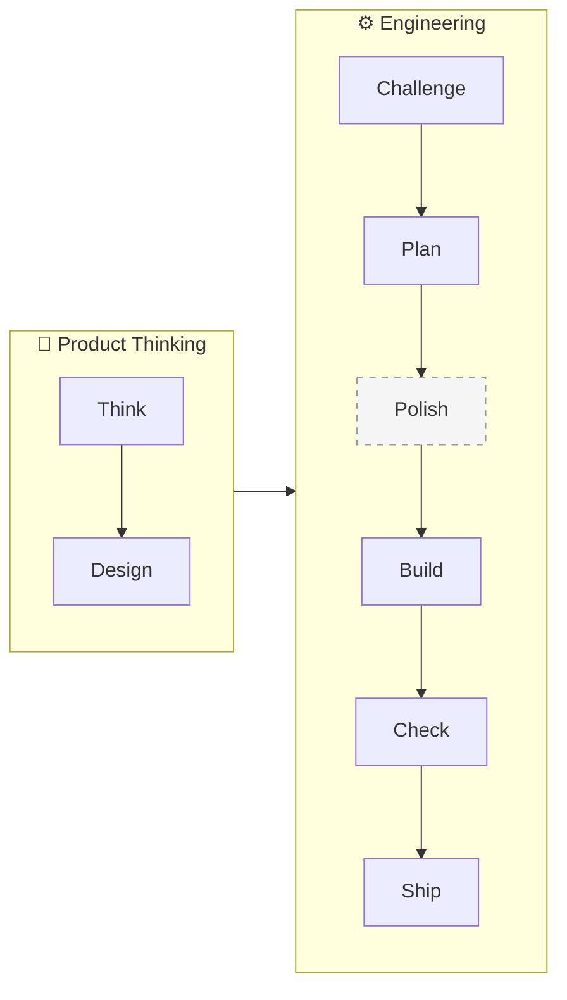
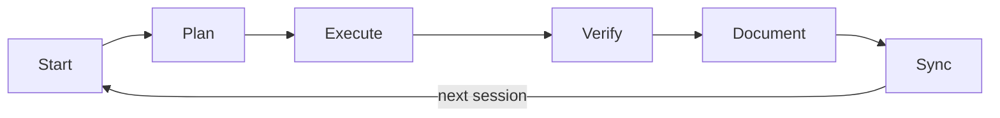
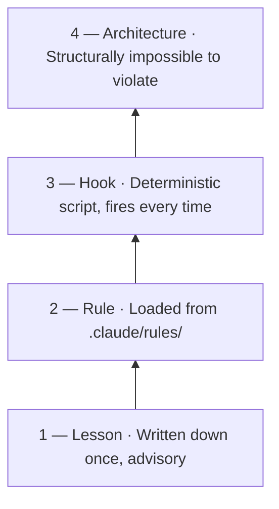
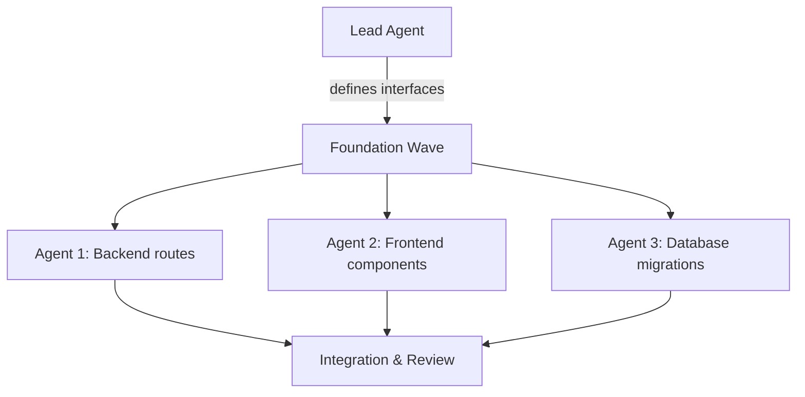

# The Build OS

A governance framework for multi-session development with Claude Code.

Build OS gives you a PM, designer, architect, engineering team, cross-model review panel, and release engineer — in a box. Product thinking comes first: a PM defines the problem and a designer shapes the experience. Then engineering takes over: an architect evaluates the approach, engineers build against a plan, three models from different families review the code through independent lenses (PM, Security, Architecture), and a release engineer runs pre-flight gates before deploying. Each stage is backed by a slash command that Claude Code can run, writing artifacts that the next stage picks up.

> **Use Build OS if** you're doing multi-session work with Claude Code and need persistent memory, clear boundaries, and enforceable rules.
> **Skip it if** you're doing one-off prompting or single-session tasks.

---

## In 30 Seconds

- **State lives on disk, not in chat.** Plans, decisions, and lessons go to files. The context window is RAM; the filesystem is memory.
- **The model proposes; deterministic code acts.** LLMs classify, summarize, and draft. Software mutates data, calls APIs, and enforces approvals.
- **Rules escalate into enforcement.** When guidance fails, promote it: lesson → rule → hook → architecture.
- **Define what before planning how.** Scope the problem before designing the solution. Build against a plan, not a conversation.

---

## The Pipeline

Build OS structures work as a pipeline. Product thinking defines the *what*; engineering delivers the *how*.



| Stage | Role | Skills | Output |
|---|---|---|---|
| **Think** | PM | `/think`, `/elevate` | Design doc or brief — the *what* and *why* |
| **Design** | Designer | `/design` (consult, review, variants, plan-check) | Visual direction, UX review, design variants |
| **Challenge** | Architect | `/challenge`, `/explore`, `/pressure-test` | Cross-model review — *should we build this?* |
| **Plan** | Lead Engineer | `/plan` (`--auto` for full pipeline) | Implementation plan — the *how* |
| **Polish** | Cross-model panel | `/polish` | 6-round iterative improvement across 3 model families |
| **Build** | Engineer | *(you + Claude Code)* | Working code against the plan |
| **Check** | Cross-model panel | `/check` | Three models review through PM, Security, and Architecture lenses |
| **Ship** | Release Engineer | `/ship` | Pre-flight gates (tests, review, verify, QA) → deploy → post-deploy smoke |

Not every task uses every stage. The framework scales with risk:

| Task type | Pipeline |
|---|---|
| **Bugfix** | `/plan` → build → `/check` → `/ship` |
| **Small feature** | `/think refine` → `/plan` → build → `/check` → `/ship` |
| **New feature** | `/think discover` → `/challenge` → `/plan` → build → `/check` → `/ship` |
| **New feature (UI)** | `/think discover` → `/design consult` → `/challenge` → `/plan` → build → `/design review` → `/check` → `/ship` |
| **Big bet** | `/think discover` → `/elevate` → `/challenge` → `/plan` → build → `/check` → `/ship` |

**If it has a UI, design is not optional.** `/design consult` establishes the design system and visual direction before engineering begins. `/design review` runs visual QA with a 94-item checklist before shipping. `/design plan-check` rates implementation plans 0-10 on design completeness. `/design variants` generates multiple visual directions when you're exploring options. These aren't nice-to-haves — building a UI without a design system produces AI slop (purple gradients, 3-column feature grids, centered-everything layouts).

Use `/plan --auto` to auto-chain the full pipeline for any tier. `/polish` can improve plans or designs before building (6 rounds across 3 model families).

Two distinct multi-model workflows: **`/challenge --deep`** is adversarial (personas attack → judge rules → collaborative refine). **`/polish`** is standalone collaborative improvement (no personas or judgment). Use `/challenge --deep` when you need to pressure-test whether something is right. Use `/polish` when you have something and want it better.

The key insight: **Think** (what are we building and why?) is a different activity from **Plan** (how do we build it?). Skipping the first leads to well-planned solutions to the wrong problem.

---

## Quick Start

```bash
git clone https://github.com/jrmoore-git/claude-build-os.git
cd claude-build-os
./setup.sh
```

`setup.sh` detects your platform, finds Python 3.11+, installs git hooks, copies templates, and writes a config cache. No interactive prompts — everything auto-detected. Then open Claude Code and run `/setup` to configure your project.

**Requirements:** [Claude Code](https://claude.ai/claude-code), git, Python 3.11+, Unix shell (macOS or Linux).

---

## Prerequisites

Build OS scales its infrastructure requirements with the governance tier. Tier 0–1 needs nothing beyond Claude Code and git. Cross-model skills need more.

### Tier 0–1: Just Claude Code

- [Claude Code](https://claude.ai/claude-code) (CLI, desktop, or IDE extension)
- git

Skills that work out of the box: `/think`, `/elevate`, `/plan`, `/ship`, `/start`, `/wrap`, `/log`, `/sync`, `/design`, `/triage`, `/setup`.

### Tier 2+: Cross-Model Review

The `/challenge`, `/challenge --deep`, `/polish`, and `/check` skills send proposals to three different model families for independent review. Different model families disagree in useful ways — models from the same family tend to agree with each other (self-preference bias), so cross-family review produces stronger signals. When all three families flag the same concern, it's almost certainly real.

**You need:**

1. **Python 3.11+** — runs hooks, the debate engine, and utility scripts
2. **API keys from three providers** (each assigned a role that plays to its strengths):
   - [Anthropic](https://console.anthropic.com/) (Claude Opus — architect persona, systems reasoning)
   - [OpenAI](https://platform.openai.com/) (GPT — security persona + judge, empirically strictest reviewer)
   - [Google AI](https://aistudio.google.com/) (Gemini — staff + PM personas, creative divergence)
3. **LiteLLM** — an open-source proxy that presents a single OpenAI-compatible endpoint and routes to the correct provider based on model name:
   ```bash
   pip install 'litellm[proxy]'
   ```
4. **OpenAI Python SDK** — used by `llm_client.py` to talk to LiteLLM (since LiteLLM exposes an OpenAI-compatible API):
   ```bash
   pip install openai
   ```

Model-to-persona assignments are configured in `config/debate-models.json` and can be changed without code modifications. Refinement rotates all three families (Gemini → GPT → Claude) so each contributes to the final output.

### Setup

```bash
# 1. Clone and enter the repo
git clone https://github.com/jrmoore-git/claude-build-os.git
cd claude-build-os

# 2. Copy example configs
cp .env.example .env
cp config/litellm-config.example.yaml config/litellm-config.yaml

# 3. Edit .env — add your API keys
#    ANTHROPIC_API_KEY=your-anthropic-key
#    OPENAI_API_KEY=sk-...
#    GEMINI_API_KEY=AI...
#    LITELLM_MASTER_KEY=sk-buildos-local-1234  (any string you choose)

# 4. Edit config/litellm-config.yaml — update model names to match your access
#    The example maps debate persona names to specific provider models.
#    Change gpt-4.1 to your available OpenAI model, etc.

# 5. Start LiteLLM
litellm --config config/litellm-config.yaml
# Runs on http://localhost:4000. Leave this terminal open.

# 6. In a new terminal, verify models are reachable
python3 scripts/debate.py check-models
```

If `check-models` shows all three models as reachable, cross-model skills will work. If a model fails, check the API key and model name in your config.

**Key scripts:**

| Script | Purpose |
|---|---|
| `scripts/debate.py` | Cross-model engine: challenge, judge, refine, review, explore, pressure-test |
| `scripts/research.py` | Deep web research via Perplexity Sonar (async deep research + sync quick lookup) |
| `scripts/recall_search.py` | BM25 + semantic search across governance files (lessons, decisions, sessions) |
| `scripts/enrich_context.py` | Extracts keywords from proposals, searches via `recall_search.py`, feeds prior context to debate models |

### What works without this setup

| Setup level | What works |
|---|---|
| **Claude Code + git only** | All skills except `/challenge` (cross-model), `/challenge --deep`, `/polish`, `/check`. Full governance framework, session management, planning, design, and shipping. |
| **+ LiteLLM + API keys** | Cross-model review and refinement. Three models independently challenge, judge, refine, and review your work. |

You can start at Tier 0 and add cross-model review later. The framework doesn't break without it — you just won't have multi-model review until you set it up.

### Optional: Deep Research (Perplexity Sonar API)

Powers the `/research` skill — deep, sourced web research with citations. Two modes: async deep research (~2-5 min, multi-source synthesis, ~$0.40-0.80) and sync quick lookup (instant, ~$0.01). Also feeds into `/explore` pre-flight for grounding divergent directions in real evidence.

```bash
# Get an API key at https://docs.perplexity.ai/
# Add to .env:
PERPLEXITY_API_KEY=pplx-...
```

**Fallback:** Without this, `/research` is unavailable and `/explore` skips research enrichment. Other skills are unaffected.

### Optional: Semantic Search (Ollama)

Gives governance search semantic similarity matching for finding conceptually related lessons and decisions, even when they don't share exact keywords. Two systems use this:

- **`/start`** — session bootstrap. Loads prior context (PRD, decisions, lessons, last handoff) at the start of each session via `recall_search.py`.
- **Context enrichment** — debate pipeline. Before `/challenge`, `/challenge --deep`, or `/check` runs, `enrich_context.py` extracts keywords from the proposal, searches governance files via `recall_search.py`, and feeds structured prior context to the cross-model reviewers. This prevents challengers from fabricating numbers by grounding them in real project history.

The two are separate concerns: `/start` orients *you* at session start; `enrich_context.py` orients *the debate models* before review. Both share the same search backend (`recall_search.py`).

```bash
brew install ollama    # or see https://ollama.ai/
ollama pull nomic-embed-text
# Add to .env:
OLLAMA_HOST=http://localhost:11434
```

Ollama runs locally — no data leaves your machine. The `nomic-embed-text` model is ~274MB.

**Fallback:** Without this, both `/start` and context enrichment use BM25 keyword search, which works well for exact term matches but misses conceptually related results.

### Optional: Headless Browser (for `/design review`, `/design consult`)

Gives design skills the ability to take screenshots, inspect live pages, and run visual QA.

**Fallback:** Without a browser, design skills work from web search results and built-in design knowledge. Visual QA (`/design review`) requires a browser — it will report "browser unavailable" without one.

---

## Why This Exists

Most people start by treating Claude Code like a chat window with tools: ask, reply, refine, repeat. That works for small tasks. It breaks once the work has state, history, and consequences.

The problem is rarely "the model is dumb." The problem is that without a system, each session starts close to zero. Specifications, decisions, and lessons that lived only in chat disappear with the window. Build OS fixes that by making the project legible on disk: a PRD for scope, decision logs for settled choices, lessons for mistakes not to repeat, and task files for current work.

The job shifts from "write a better prompt" to "build a better operating environment."

---

## The Session Loop

Within each stage of the pipeline, every Build OS session follows the same loop:



| Step | What happens |
|---|---|
| **Start** | Load prior context from disk: PRD, decisions, lessons, last handoff |
| **Plan** | Write the approach to a file before building |
| **Execute** | Implement against the plan |
| **Verify** | Prove it works — tests, output, screenshots, manual checks |
| **Document** | Capture decisions and lessons |
| **Sync** | Update the PRD and task state; save the handoff for the next session |

Chat is a poor place to store project state. A written plan, a numbered lesson, or a logged decision can be reloaded, cited, reviewed, and enforced later. That is the difference between "Claude helped with a task" and "Claude is operating inside a system."

---

## What Lives on Disk

Build OS keeps project state in a predictable file structure. Tier 0 needs only `CLAUDE.md` and git. Here is a typical layout for Tier 1 and above:

```
project-root/
├── CLAUDE.md                  # Top-level instructions for Claude
├── .claude/
│   ├── rules/                 # Rules loaded automatically each session
│   │   └── no-raw-sql.md
│   └── skills/                # Slash commands Claude can invoke
│       ├── think/
│       ├── plan/
│       ├── check/
│       └── ship/
├── docs/
│   ├── prd.md                 # Product requirements — the source of truth
│   ├── decisions.md           # Numbered decision log with rationale
│   └── lessons.md             # Numbered lessons from mistakes
├── tasks/
│   ├── current.md             # Active task: goal, plan, status, blockers
│   └── handoff.md             # What the next session needs to know
└── tests/                     # At least one smoke test (Tier 2+)
```

| File | Purpose | Updated when |
|---|---|---|
| `CLAUDE.md` | Project-wide instructions and constraints | Setup; major scope changes |
| `docs/prd.md` | What you're building and why | Scope changes approved by human |
| `docs/decisions.md` | Settled choices with rationale | Any non-trivial "why" is resolved |
| `docs/lessons.md` | Mistakes and surprises, numbered | Something unexpected happens |
| `tasks/current.md` | Active task with plan and status | Every session |
| `tasks/handoff.md` | Context for the next session | End of every session |
| `.claude/rules/` | Standing rules Claude must follow | A lesson gets promoted |
| `.claude/skills/` | Reusable procedures as slash commands | A workflow gets formalized |

**The key principle:** if it must survive the session, it belongs in a file.

---

## The Enforcement Ladder

Memory gives you continuity. The enforcement ladder gives you control.

Instructions in `CLAUDE.md` are guidance. Claude will often follow them. Under time pressure, ambiguous context, or competing goals, guidance alone may not hold. Why? Because the model is not executing a fixed procedure — it is predicting the next best action from a limited context window. The model is not malicious; it is probabilistic. Deterministic checks are stronger than advisory text.



A concrete example: telling the model "do not hallucinate contact data" does not reliably stop it from inventing an email address from a person's name and company. A validation hook that checks generated addresses against a real source does. If a rule matters, reduce discretion.

> If you've told Claude to do something three times and it still gets missed, stop rewriting the instruction. Move it up the ladder.

---

## Governance Tiers

Start at the lowest tier that matches your risk. Move up when the stakes increase.

| Tier | You're building... | What you add |
|---|---|---|
| **0 — Advisory** | Personal projects, learning, solo exploration | `CLAUDE.md` + git + human review |
| **1 — Structured** | Multi-session projects, anything lasting >1 week | + PRD, decisions log, lessons log, handoff |
| **2 — Enforced** | Production systems, real users, financial consequences | + hooks, contract tests, review protocol |
| **3 — Production OS** | Autonomous agents, acts on your behalf, sensitive data | + cross-model review, kill switches, approval gating |

**What goes wrong if you stay too low:**

- **Tier 0:** You lose context between sessions, repeat old decisions, and spend the start of every session re-explaining the project.
- **Tier 1:** Docs exist, but nothing forces compliance. The model skips tests or makes risky edits because the rules are only advisory.
- **Tier 2:** Code changes are controlled, but the system can still take expensive or high-impact actions unless approvals and shutdown paths are explicit.

> **Upgrade triggers:**
> Lost context between sessions → **Tier 1**.
> Claude made risky changes without review → **Tier 2**.
> The system acts on your behalf → **Tier 3**.

---

## Parallel Work and Multi-Agent Teams

Build OS is designed for parallelization. When a task has three or more independent components, it should be decomposed into parallel agents rather than executed sequentially.



**Decomposition gate:** A hook blocks the first write in each session until you assess whether the task should be parallelized. Three or more independent file groups? Decompose. One tightly coupled change? Proceed normally. This enforces the habit because Claude defaults to sequential execution even when tasks are clearly independent.

**How it works in practice:**

- **Subagents** run within a session. They accept a task, execute it, and report back. They can't communicate with each other. Use them when work is cleanly decomposable.
- **Agent teams** spawn independent sessions with shared task lists and teammate coordination. Use them when agents need to share findings or coordinate on interfaces during execution.
- **Worktree isolation** gives each parallel agent its own git checkout, preventing file collisions and merge conflicts. Write-capable agents running in parallel must use worktree isolation — this is not optional.

**The critical rule:** define interface contracts *before* agents spin up. If two agents build components that interact, the lead must write the contract as a file both sides reference. Without this, you get multiple agents producing plausible code that doesn't integrate. The pattern: foundation wave (shared schema, types, stubs) → parallel execution.

For the full guide — spawn prompts, token budgets, custom agent definitions, and orchestration patterns — see the [Team Playbook](docs/team-playbook.md).

---

## The Skills

Build OS ships with 18 skills — slash commands that implement the pipeline stages. Think of them as the team members you'd want on a real project:

| Role | Skills | What they do |
|---|---|---|
| **PM** | `/think`, `/elevate`, `/start` | Problem discovery, scope review, session bootstrap + routing |
| **Designer** | `/design` (consult, review, variants, plan-check) | Design system, visual QA, variant exploration, plan design audit |
| **Architect** | `/challenge`, `/explore`, `/pressure-test` | Cross-model gate, divergent options, adversarial analysis |
| **Refiner** | `/polish` | 6-round cross-model collaborative improvement on any document |
| **Lead Engineer** | `/plan` (`--auto` for full pipeline) | Implementation planning, auto-tier detection |
| **Reviewer** | `/check` | Cross-model code review (3 lenses: PM, Security, Architecture). `--fix` auto-fixes mechanical issues. `--fix-loop` runs fix → re-review cycles (max 3 iterations). `--qa`, `--governance`, `--second-opinion`, `--all` for additional checks. |
| **Researcher** | `/research` | Deep web research via Perplexity Sonar with citations (async deep + sync quick) |
| **Release** | `/ship`, `/sync` | Pre-flight gates (verify + QA + tests + review) → deploy → doc sync |
| **Session** | `/start`, `/wrap`, `/log`, `/triage` | Bootstrap + routing, session close, knowledge capture, info routing |
| **Bootstrap** | `/setup`, `/audit` | Interactive project setup, two-phase blind discovery audit |

Running `/think` → `/challenge` → `/plan` → build → `/check` → `/ship` gives you the equivalent of a PM defining scope, an architect stress-testing the approach, engineers building, a cross-model review panel checking quality, and a release engineer running pre-flight gates before deploying. `/ship` includes verification (adversarial probes), QA dimensions, and all other gates inline — the standard path is `/check` → `/ship`, not a longer chain. Each skill writes artifacts to disk so the next stage (or session) picks up where the last one left off. Pipeline progress is tracked in manifest files (`tasks/<topic>-manifest.json`) so you can see which stages have completed for any topic.

**Recent additions (v3.1):** Challengers get optional read-only verifier tools (`--enable-tools`) to check claims against the actual codebase. Quantitative claims must be tagged as EVIDENCED, ESTIMATED, or SPECULATIVE — speculative claims alone can't drive material verdicts. `/check --fix-loop` automates the fix → re-review cycle. Proposals use a structured template with mandatory sections (Current System Failures, Operational Context, Baseline Performance) to prevent challengers from fabricating numbers.

You don't need all of them. Start with `/plan` and `/check`. Add the rest as your workflow matures.

---

## Common Pitfalls

**Scope creep through helpfulness.** Claude will often add features, abstractions, or "improvements" you didn't ask for. The model optimizes for being helpful, not for staying in scope. The PRD and task file are your defense: if it's not in scope, it doesn't ship.

**Confident but wrong mocks.** Claude will generate mocks based on its understanding of an API, which may be outdated or incorrect. A test suite can pass perfectly while validating the wrong behavior. Keep at least one smoke test that hits the real integration path.

**Cost discipline is architecture.** A budget written in a doc is not a control. If every scheduled job defaults to the strongest model, your "policy" is fiction. Limits and routing need to exist in code.

---

## Starter Kit

If you do nothing else:

**Essential:**
1. **Create a PRD** that Claude references every session. Numbered sections, explicit scope, clear non-goals.
2. **Define before planning.** Articulate *what* you're building and *why* before designing *how*.
3. **Plan before building.** Write the plan to a file. Review it. Then execute.
4. **Write to disk, not context.** Plans, reviews, decisions, and handoffs all go to files.

**Add as you scale:**
5. **Keep a lessons log.** Record every surprise and mistake, numbered and referenceable.
6. **Draw the LLM boundary.** LLMs classify and draft. Deterministic code validates and acts.
7. **Use hooks for enforcement.** If a rule keeps getting missed, enforce it in code.
8. **Test from day one.** Create the test directory alongside `git init`, not after the first incident.

---

## Staying Updated

Build OS is actively maintained. Rules, hooks, skills, and scripts improve as we learn from real multi-session projects. To pull improvements:

```bash
git pull origin main
./setup.sh   # re-runs safely — idempotent, won't overwrite your files
```

`setup.sh` only copies templates to `docs/` and `tasks/` if the destination doesn't already exist. Your project-specific files (PRD, decisions, lessons) are never overwritten. Updated hooks, skills, rules, and scripts take effect immediately.

**What updates include:** New skills, hook improvements, better debate prompts, portability fixes, new contract tests, and documentation. **What never changes:** Your project files, `.env`, or `config/litellm-config.yaml`.

---

## Docs Map

**Start here:**

| You want to... | Read |
|---|---|
| **Get running in an hour** | [Getting Started](docs/getting-started.md) — guided first-hour tutorial: define, plan, build, review, ship |
| **Quick reference while working** | [Cheat Sheet](docs/cheat-sheet.md) — pipeline tiers, all 18 skills, key files, shortcuts |

**Go deeper:**

| You want to... | Read |
|---|---|
| **Understand the philosophy** | [Why Build OS Exists](docs/why-build-os.md) — the narrative case for governance over prompting |
| **Learn the full framework** | [The Build OS](docs/the-build-os.md) — governance tiers, file system, operations, enforcement, memory, review, bootstrap |
| **Run a team project** | [Team Playbook](docs/team-playbook.md) — agent teams, parallel work, orchestration |
| **Build a production system** | [Advanced Patterns](docs/advanced-patterns.md) — audit protocol, degradation testing, failure classes |

**Reference:**

| You want to... | Read |
|---|---|
| **Understand Claude Code features** | [Platform Features](docs/platform-features.md) — hooks, rules, skills, memory, session management |
| **See what each script does** | [How It Works](docs/how-it-works.md) — debate.py, tier_classify.py, recall_search.py, and all tooling |
| **Configure cross-model review** | [Infrastructure](docs/infrastructure.md) — LiteLLM setup, API keys, optional dependencies |
| **Understand the 15 hooks** | [Hooks Reference](docs/hooks.md) — plan gate, review gate, decompose gate, and 12 more |
| **Route models by cost** | [Model Routing Guide](docs/model-routing-guide.md) — task classification, per-skill defaults, escalation |

---

The model keeps getting smarter. The discipline around it is what you still have to build yourself.
