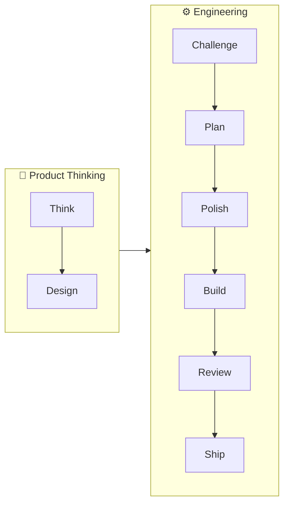
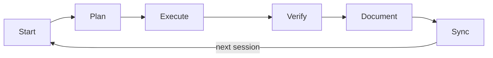
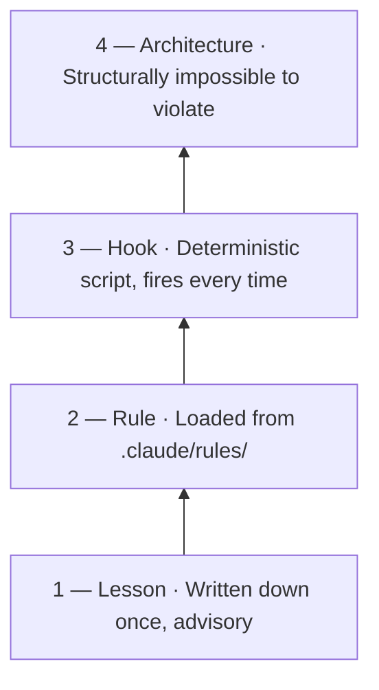
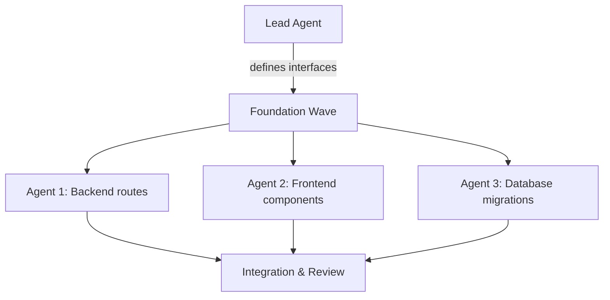

# The Build OS

A governance framework for multi-session development with Claude Code.

Build OS gives you a PM, designer, architect, engineering team, cross-model review panel, and release engineer — in a box. Product thinking comes first: a PM defines the problem and a designer shapes the experience. Then engineering takes over: an architect evaluates the approach, engineers build against a plan, three models from different families review the code through independent lenses (PM, Security, Architecture), and a release engineer runs pre-flight gates before deploying. Each stage is backed by a slash command that Claude Code can run, writing artifacts that the next stage picks up.

> **Use Build OS if** you're doing multi-session work with Claude Code and need persistent memory, clear boundaries, and enforceable rules.
> **Skip it if** you're doing one-off prompting or single-session tasks.

---

## You Don't Need to Memorize Anything

Just describe what you want to do. Build OS routes you to the right tool automatically.

- **"I want to build a new feature"** — Claude runs problem discovery, then planning, then builds
- **"Something broke"** — Claude runs root-cause analysis before touching code
- **"Is this ready to ship?"** — Claude runs cross-model review, then pre-flight gates
- **"I'm lost"** — type `/guide` for a map of everything, organized by intent

Build OS has 22 skills, but you don't need to know any of them by name. The slash commands (`/think`, `/plan`, `/review`, etc.) are power-user shortcuts. The primary interface is natural language — say what you need, and the system figures out the rest.

---

## In 30 Seconds

- **State lives on disk, not in chat.** Plans, decisions, and lessons go to files. The context window is RAM; the filesystem is memory.
- **The model proposes; deterministic code acts.** LLMs classify, summarize, and draft. Software mutates data, calls APIs, and enforces approvals.
- **Rules escalate into enforcement.** When guidance fails, promote it: lesson → rule → hook → architecture.
- **Define what before planning how.** Scope the problem before designing the solution. Build against a plan, not a conversation.

---

## Why This Exists

Most people start by treating Claude Code like a chat window with tools: ask, reply, refine, repeat. That works for small tasks. It breaks once the work has state, history, and consequences.

The problem is rarely "the model is dumb." The problem is that without a system, each session starts close to zero. Specifications, decisions, and lessons that lived only in chat disappear with the window. Build OS fixes that by making the project legible on disk: a PRD for scope, decision logs for settled choices, lessons for mistakes not to repeat, and task files for current work.

The job shifts from "write a better prompt" to "build a better operating environment."

---

## Pick Your Starting Tier

Start at the lowest tier that matches your risk. Upgrade when the stakes increase.

- **Solo hobby project, learning, exploration** → **Tier 0** (CLAUDE.md + git)
- **Multi-session work, anything lasting >1 week** → **Tier 1** (+ PRD, decisions, lessons, handoff)
- **Production systems, real users, financial consequences** → **Tier 2** (+ hooks, contract tests, review)
- **Autonomous agents, acts on your behalf, sensitive data** → **Tier 3** (+ cross-model review, approvals, kill switches)

Full tier details with governance consequences are in [Governance Tiers](#governance-tiers) further down. You don't need to decide now — `/setup` will pick a tier based on your answers.

---

## Prerequisites

Build OS scales its infrastructure requirements with the governance tier.

### Tier 0–1: Just Claude Code

- [Claude Code](https://claude.ai/claude-code) (CLI, desktop, or IDE extension)
- git

Skills that work out of the box: `/think`, `/elevate`, `/plan`, `/ship`, `/start`, `/wrap`, `/log`, `/sync`, `/design`, `/triage`, `/setup`, `/guide`, `/investigate`, `/healthcheck`, `/audit`.

### Tier 2+: Cross-Model Review

The `/challenge`, `/challenge --deep`, `/polish`, and `/review` skills send proposals to three different model families for independent review. Different model families disagree in useful ways — models from the same family tend to agree with each other (self-preference bias), so cross-family review produces stronger signals.

**You need:** Python 3.11+, API keys from three providers (Anthropic, OpenAI, Google AI), LiteLLM, and the OpenAI Python SDK. Model-to-persona assignments are configured in `config/debate-models.json`.

**Full setup instructions:** [Infrastructure](docs/infrastructure.md).

| Setup level | What works |
|---|---|
| **Claude Code + git only** | All skills except `/challenge` (cross-model), `/challenge --deep`, `/polish`, `/review`. Full governance framework, session management, planning, design, and shipping. |
| **+ LiteLLM + API keys** | Cross-model review and refinement. Three models independently challenge, judge, refine, and review your work. |

You can start at Tier 0 and add cross-model review later. The framework doesn't break without it — you just won't have multi-model review until you set it up.

### Optional capabilities

| Capability | What it powers | Setup |
|---|---|---|
| **Perplexity Sonar API** | `/research` — deep web research with citations | Add `PERPLEXITY_API_KEY` to `.env`. [Details](docs/infrastructure.md) |
| **Ollama** | Semantic search across governance files | `brew install ollama && ollama pull nomic-embed-text`. [Details](docs/infrastructure.md) |
| **Headless browser** | `/design review` — visual QA with screenshots | Install [gstack](https://github.com/garrytan/gstack), run `bash scripts/setup-design-tools.sh`. [Details](docs/infrastructure.md) |

Without these, skills fall back to keyword search, Claude's built-in web search, and design knowledge without screenshots. The core pipeline never requires them.

---

## Quick Start

Not sure where to start? Tier 0 (CLAUDE.md + git) works for most projects. Add tiers as stakes increase.

```bash
git clone https://github.com/jrmoore-git/claude-build-os.git
cd claude-build-os
./setup.sh
```

`setup.sh` detects your platform, finds Python 3.11+, installs git hooks, copies templates, and writes a config cache. No interactive prompts — everything auto-detected. Then open Claude Code and run `/setup` to configure your project.

**First time?** Read the [Getting Started Guide](docs/getting-started.md) to build your first feature in an hour.

**Not an engineer?** Read [Non-Engineer Start Here](docs/non-engineer-start-here.md) first — it shows what works at each level of setup (browser only → Claude Code → full API-key setup). Hit unfamiliar terms? The [Glossary](docs/glossary.md) has plain-English definitions.

### Your First 10 Minutes

Concrete checklist once you have the repo cloned:

1. `./setup.sh` — installs hooks, copies templates, caches config.
2. Open Claude Code in the project directory.
3. Run `/setup` — 3 questions, generates your `docs/project-prd.md`.
4. Run `/think discover` — structured problem discovery; writes a design doc.
5. Run `/plan` — writes an implementation plan to disk.
6. Build — normal Claude Code usage against the plan.
7. Run `/review` if you have API keys configured (otherwise do a manual review).
8. Run `/ship` — pre-flight gates → commit → deploy.

Each step writes to disk, so next session can pick up where you stopped.

---

## Starter Kit

If you do nothing else:

**Essential:**
1. **Have a PRD that Claude references every session.** `/setup` generates one from your answers to a few questions — you don't write it from scratch. Numbered sections, explicit scope, clear non-goals.
2. **Define before planning.** Articulate *what* you're building and *why* before designing *how*. Run `/think discover` — it does this for you.
3. **Plan before building.** Run `/plan` — it writes the plan to a file. Review it. Then execute.
4. **Write to disk, not context.** Plans, reviews, decisions, and handoffs all go to files. BuildOS skills do this by default.

**Add as you scale:**
5. **Keep a lessons log.** Record every surprise and mistake, numbered and referenceable.
6. **Draw the LLM boundary.** LLMs classify and draft. Deterministic code validates and acts.
7. **Use hooks for enforcement.** If a rule keeps getting missed, enforce it in code.
8. **Test from day one.** Create the test directory alongside `git init`, not after the first incident.

---

## The Pipeline

**Pipeline = stages across a feature.** (The [Session Loop](#the-session-loop) below covers what every single session does, no matter which pipeline stage it's in.)

Build OS structures work as a pipeline. Product thinking defines the *what*; engineering delivers the *how*.



| Stage | Role | Skills | Output |
|---|---|---|---|
| **Think** | PM | `/think`, `/elevate` | Design doc or brief — the *what* and *why* |
| **Design** | Designer | `/design` (consult, review, variants, plan-check) | Visual direction, UX review, design variants |
| **Challenge** | Architect | `/challenge`, `/explore`, `/pressure-test` | Cross-model review — *should we build this?* |
| **Plan** | Lead Engineer | `/plan` (`--auto` for full pipeline) | Implementation plan — the *how* |
| **Polish** | Cross-model panel | `/polish` | 6-round iterative improvement across 3 model families |
| **Build** | Engineer | *(you + Claude Code)* | Working code against the plan |
| **Check** | Cross-model panel | `/review` | Three models review through PM, Security, and Architecture lenses |
| **Ship** | Release Engineer | `/ship` | Pre-flight gates (tests, review, verify, QA) → deploy → post-deploy smoke |

Not every task uses every stage. The framework scales with risk:

| Task type | Pipeline |
|---|---|
| **Bugfix** | `/plan` → build → `/review` → `/ship` |
| **New feature** | `/think` → `/challenge` → `/plan` → build → `/review` → `/ship` |
| **New feature (UI)** | add `/design consult` before `/plan`, `/design review` before `/ship` |

For spikes, big bets, and the full tier breakdown — see the [Cheat Sheet](docs/cheat-sheet.md).

Use `/plan --auto` to auto-chain the full pipeline for any tier. The key insight: **Think** (what are we building and why?) is a different activity from **Plan** (how do we build it?). Skipping the first leads to well-planned solutions to the wrong problem.

---

## The Session Loop

Within each stage of the pipeline, every Build OS session follows the same loop:



| Step | What happens |
|---|---|
| **Start** | Load prior context from disk: PRD, decisions, lessons, last handoff |
| **Plan** | Write the approach to a file before building |
| **Execute** | Implement against the plan |
| **Verify** | Prove it works — tests, output, screenshots, manual checks |
| **Document** | Capture decisions and lessons |
| **Sync** | Update the PRD and task state; save the handoff for the next session |

Chat is a poor place to store project state. A written plan, a numbered lesson, or a logged decision can be reloaded, cited, reviewed, and enforced later. That is the difference between "Claude helped with a task" and "Claude is operating inside a system."

---

## What Lives on Disk

Build OS keeps project state in a predictable file structure. Tier 0 needs only `CLAUDE.md` and git. Here is a typical layout for Tier 1 and above:

```
project-root/
├── CLAUDE.md                  # Top-level instructions for Claude
├── .claude/
│   ├── rules/                 # Rules loaded automatically each session
│   │   └── code-quality.md
│   └── skills/                # Slash commands Claude can invoke
│       ├── think/
│       ├── plan/
│       ├── review/
│       └── ship/
├── docs/
│   └── project-prd.md         # Product requirements — the source of truth
├── tasks/
│   ├── decisions.md           # Numbered decision log with rationale
│   ├── lessons.md             # Numbered lessons from mistakes
│   ├── handoff.md             # What the next session needs to know
│   └── <topic>-plan.md        # Active plans per topic
└── tests/                     # At least one smoke test (Tier 2+)
```

| File | Purpose | Updated when |
|---|---|---|
| `CLAUDE.md` | Project-wide instructions and constraints | Setup; major scope changes |
| `docs/project-prd.md` | What you're building and why | Scope changes approved by human |
| `tasks/decisions.md` | Settled choices with rationale | Any non-trivial "why" is resolved |
| `tasks/lessons.md` | Mistakes and surprises, numbered | Something unexpected happens |
| `tasks/handoff.md` | Context for the next session | End of every session |
| `tasks/<topic>-plan.md` | Active plans per topic | Planning and execution |
| `.claude/rules/` | Standing rules Claude must follow | A lesson gets promoted |
| `.claude/skills/` | Reusable procedures as slash commands | A workflow gets formalized |

**The key principle:** if it must survive the session, it belongs in a file.

---

## Governance Tiers

Start at the lowest tier that matches your risk. Move up when the stakes increase.

| Tier | You're building... | What you add |
|---|---|---|
| **0 — Advisory** | Personal projects, learning, solo exploration | `CLAUDE.md` + git + human review |
| **1 — Structured** | Multi-session projects, anything lasting >1 week | + PRD, decisions log, lessons log, handoff |
| **2 — Enforced** | Production systems, real users, financial consequences | + hooks, contract tests, review protocol |
| **3 — Production OS** | Autonomous agents, acts on your behalf, sensitive data | + cross-model review, kill switches, approval gating |

**What goes wrong if you stay too low:**

- **Tier 0:** You lose context between sessions, repeat old decisions, and spend the start of every session re-explaining the project.
- **Tier 1:** Docs exist, but nothing forces compliance. The model skips tests or makes risky edits because the rules are only advisory.
- **Tier 2:** Code changes are controlled, but the system can still take expensive or high-impact actions unless approvals and shutdown paths are explicit.

> **Upgrade triggers:**
> Lost context between sessions → **Tier 1**.
> Claude made risky changes without review → **Tier 2**.
> The system acts on your behalf → **Tier 3**.

---

## The Enforcement Ladder

Memory gives you continuity. The enforcement ladder gives you control.

Instructions in `CLAUDE.md` are guidance. Claude will often follow them. Under time pressure, ambiguous context, or competing goals, guidance alone may not hold. Why? Because the model is not executing a fixed procedure — it is predicting the next best action from a limited context window. The model is not malicious; it is probabilistic. Deterministic checks are stronger than advisory text.



A concrete example: telling the model "do not hallucinate contact data" does not reliably stop it from inventing an email address from a person's name and company. A validation hook that checks generated addresses against a real source does. If a rule matters, reduce discretion.

> If you've told Claude to do something three times and it still gets missed, stop rewriting the instruction. Move it up the ladder.

A lessons file that only grows is a governance failure. Lessons must promote to rules, rules must promote to hooks, or they must be archived. Accumulation without promotion means the system isn't learning — it's hoarding.

---

## The Skills

Build OS ships with 22 skills. You don't need to learn them — just describe what you're doing and Claude picks the right one. These are the ones you'll use most:

| You want to... | Use | What it does |
|---|---|---|
| Define scope | `/think` | Problem discovery with forcing questions |
| Plan implementation | `/plan` | Write a plan with verification and rollback |
| Review code | `/review` | Cross-model review through PM, Security, Architecture lenses |
| Ship safely | `/ship` | Pre-flight gates → deploy → post-deploy smoke |
| Get oriented | `/start` | Session bootstrap — loads context, suggests next step |
| Design a UI | `/design` | 4 modes: consult, review, variants, plan-check |
| Debug something | `/investigate` | Structured root-cause analysis |

**Specialized skills:** `/challenge` (cross-model go/no-go gate), `/explore` (divergent options), `/pressure-test` (adversarial analysis), `/polish` (6-round cross-model refinement), `/research` (deep web research with citations), `/elevate` (scope review), `/prd` (PRD generation), `/audit` (codebase discovery), `/healthcheck` (learning system health), `/triage` (classify incoming info), `/log` (capture decisions), `/sync` (post-ship doc sync), `/wrap` (session close), `/guide` (skill map), `/setup` (project setup).

Full reference with flags and modes: [Cheat Sheet](docs/cheat-sheet.md).

---

## Common Pitfalls

**Scope creep through helpfulness.** Claude will often add features, abstractions, or "improvements" you didn't ask for. The model optimizes for being helpful, not for staying in scope. The PRD and task file are your defense: if it's not in scope, it doesn't ship.

**Confident but wrong mocks.** Claude will generate mocks based on its understanding of an API, which may be outdated or incorrect. A test suite can pass perfectly while validating the wrong behavior. Keep at least one smoke test that hits the real integration path.

**Cost discipline is architecture.** A budget written in a doc is not a control. If every scheduled job defaults to the strongest model, your "policy" is fiction. Limits and routing need to exist in code.

---

## Parallel Work and Multi-Agent Teams

Build OS is designed for parallelization. When a task has three or more independent components, it should be decomposed into parallel agents rather than executed sequentially.



**Decomposition gate:** A hook blocks the first write in each session until you assess whether the task should be parallelized. Three or more independent file groups? Decompose. One tightly coupled change? Proceed normally. This enforces the habit because Claude defaults to sequential execution even when tasks are clearly independent.

**How it works in practice:**

- **Subagents** run within a session. They accept a task, execute it, and report back. They can't communicate with each other. Use them when work is cleanly decomposable.
- **Agent teams** spawn independent sessions with shared task lists and teammate coordination. Use them when agents need to share findings or coordinate on interfaces during execution.
- **Worktree isolation** gives each parallel agent its own git checkout, preventing file collisions and merge conflicts. Write-capable agents running in parallel must use worktree isolation — this is not optional.

**The critical rule:** define interface contracts *before* agents spin up. If two agents build components that interact, the lead must write the contract as a file both sides reference. Without this, you get multiple agents producing plausible code that doesn't integrate. The pattern: foundation wave (shared schema, types, stubs) → parallel execution.

For the full guide — spawn prompts, token budgets, custom agent definitions, and orchestration patterns — see the [Team Playbook](docs/team-playbook.md).

---

## Staying Updated

Build OS is actively maintained. Rules, hooks, skills, and scripts improve as we learn from real multi-session projects. To pull improvements:

```bash
git pull origin main
./setup.sh   # re-runs safely — idempotent, won't overwrite your files
```

`setup.sh` only copies templates to `docs/` and `tasks/` if the destination doesn't already exist. Your project-specific files (PRD, decisions, lessons) are never overwritten. Updated hooks, skills, rules, and scripts take effect immediately.

**What updates include:** New skills, hook improvements, better debate prompts, portability fixes, new contract tests, and documentation. **What never changes:** Your project files, `.env`, or `config/litellm-config.yaml`.

---

## Docs Map

**Start here:**

| You want to... | Read |
|---|---|
| **Get running in an hour** | [Getting Started](docs/getting-started.md) — guided first-hour tutorial: define, plan, build, review, ship |
| **Quick reference while working** | [Cheat Sheet](docs/cheat-sheet.md) — pipeline tiers, all 22 skills, key files, shortcuts |

**Go deeper:**

| You want to... | Read |
|---|---|
| **Understand the philosophy** | [Why Build OS Exists](docs/why-build-os.md) — the narrative case for governance over prompting |
| **Learn the full framework** | [The Build OS](docs/the-build-os.md) — governance tiers, file system, operations, enforcement, memory, review, bootstrap |
| **Run a team project** | [Team Playbook](docs/team-playbook.md) — agent teams, parallel work, orchestration |
| **Build a production system** | [Advanced Patterns](docs/advanced-patterns.md) — audit protocol, degradation testing, failure classes |

**Reference:**

| You want to... | Read |
|---|---|
| **Understand Claude Code features** | [Platform Features](docs/platform-features.md) — hooks, rules, skills, memory, session management |
| **See what each script does** | [How It Works](docs/how-it-works.md) — debate.py, tier_classify.py, recall_search.py, and all tooling |
| **Configure cross-model review** | [Infrastructure](docs/infrastructure.md) — LiteLLM setup, API keys, optional dependencies |
| **Understand the 22 hooks** | [Hooks Reference](docs/hooks.md) — plan gate, review gate, decompose gate, and 19 more |
| **Route models by cost** | [Model Routing Guide](docs/model-routing-guide.md) — task classification, per-skill defaults, escalation |

---

The model keeps getting smarter. The discipline around it is what you still have to build yourself.
