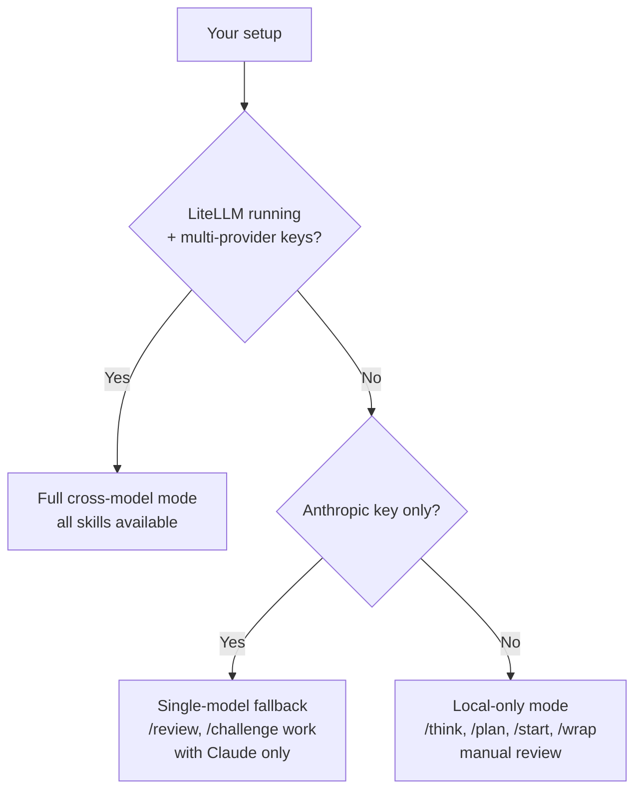
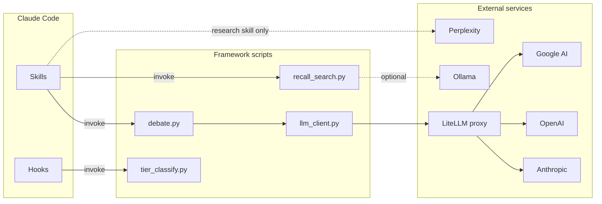

# Infrastructure

What each dependency does and why the Build OS needs it.

---

## Setup matrix — what you need and when

| Component | Required? | Env vars / config | Verify with | Unlocks |
|---|---|---|---|---|
| [Claude Code](https://claude.ai/claude-code) | **Required** | — | `claude --version` | The framework itself — everything runs inside Claude Code |
| git | **Required** | — | `git --version` | Version control, hooks, plan-gate |
| Python 3.11+ | **Required** | — | `python3.11 --version` | All `scripts/` tooling (`debate.py`, `tier_classify.py`, etc.) |
| Unix shell (macOS / Linux) | **Required** | — | `bash --version` | Hook scripts, `setup.sh` |
| Anthropic API key | Needed for cross-model | `ANTHROPIC_API_KEY` in `.env` | `grep ANTHROPIC .env` | Claude calls in `/challenge`, `/review`, `/refine` |
| OpenAI API key | Needed for cross-model | `OPENAI_API_KEY` in `.env` | `grep OPENAI .env` | GPT calls (judge, security, frame-factual) |
| Google AI key | Needed for cross-model | `GOOGLE_API_KEY` or `GEMINI_API_KEY` in `.env` | `grep -E 'GOOGLE\|GEMINI' .env` | Gemini calls (architect, staff, pm) |
| LiteLLM | Needed for cross-model | `config/litellm-config.yaml`, `docker ps \| grep litellm` | `curl -s localhost:4000/health` | Routes to all three providers through one API |
| Perplexity Sonar | Optional | `PERPLEXITY_API_KEY` in `.env` | `grep PERPLEXITY .env` | `/research` — deep web research with citations |
| Ollama | Optional | `ollama list \| grep nomic` | `ollama list` | Semantic search across governance files |
| gstack + headless browser | Optional | `~/.claude/skills/gstack/` exists | `bash scripts/browse.sh --help` | `/design review` — visual QA with screenshots |

**Three operational modes:**



---

## Dependency map



---

## Required Dependencies

### Python 3

All Build OS scripts are Python. `debate.py`, `tier_classify.py`, `recall_search.py`, `finding_tracker.py`, `enrich_context.py`, and `artifact_check.py` all require Python 3.

Python 3.11+ is required (`setup.sh` enforces this). No third-party Python packages are required for the pipeline skills themselves.

### LiteLLM

The cross-model debate engine (`/challenge`, `/challenge --deep`, `/review`) calls models from multiple provider families through a single API. LiteLLM is the routing layer that makes this possible. Scripts call LiteLLM's OpenAI-compatible API at `http://localhost:4000` via stdlib `urllib.request` — no pip install needed in your project.

```bash
# Copy and configure
cp config/litellm-config.example.yaml config/litellm-config.yaml

# Docker (recommended)
docker run -d -p 4000:4000 --name litellm \
  --env-file .env \
  -v $(pwd)/config/litellm-config.yaml:/app/config.yaml \
  ghcr.io/berriai/litellm:main-latest \
  --config /app/config.yaml

# Or standalone (in its own venv)
pip install litellm
litellm --config config/litellm-config.yaml
```

Why a proxy instead of direct API calls: `debate.py` calls multiple model families in a single pipeline. LiteLLM normalizes the API surface so the scripts don't need provider-specific client code. Swapping a model is a config change in `litellm-config.yaml` + `config/debate-models.json`, not a code change.

**Important:** The `model_name` fields in `litellm-config.yaml` must match the model names in `config/debate-models.json`. The example config ships with matching names. If you change one, change both.

### API Keys (at least two model families)

The debate engine uses adversarial review across model families. Models from the same family agree with each other too easily (self-preference bias). Cross-family disagreement produces stronger review signals.

You need API keys for at least two of (all three recommended):

| Provider | Role in debate | Get a key |
|----------|---------------|-----------|
| **Anthropic** (Claude) | Author + PM challenger + refiner | [console.anthropic.com](https://console.anthropic.com/) |
| **OpenAI** (GPT) | Judge + security challenger | [platform.openai.com](https://platform.openai.com/) |
| **Google AI** (Gemini) | Architect + staff challenger | [aistudio.google.com](https://aistudio.google.com/) |

Copy `.env.example` to `.env` and fill in your keys. Model-to-role assignments are in `config/debate-models.json`.

### Single-Credential Fallback (No LiteLLM Required)

If you don't have LiteLLM configured, BuildOS can fall back to single-model review using your Anthropic API key directly:

```bash
export ANTHROPIC_API_KEY=your-key-here   # enables /review, /challenge without LiteLLM
```

This gives you structured review through PM/Security/Architecture lenses using Claude, but all reviews come from the same model. For cross-model review (stronger disagreement signals), set up LiteLLM with multiple providers above.

**Note:** Claude Code's built-in OAuth authentication does not expose an API key for this path. You need a separately provisioned `ANTHROPIC_API_KEY` from [console.anthropic.com](https://console.anthropic.com/).

**What works in fallback mode:**
- `/challenge`, `/review`, `/judge`, `/refine` — all produce artifacts in standard format
- Structured review lenses (PM, Security, Architecture) via prompt engineering
- Artifact frontmatter with accurate model provenance (`execution_mode: fallback_single_model`)

**What you lose:**
- Cross-family disagreement (no GPT/Gemini perspectives)
- Independent judge evaluation (recorded as `independence: degraded_single_model`)
- `--enable-tools` (tool-use loops require LiteLLM proxy)

### Per-Model Timeouts

Preview/reasoning models with extreme tail latency get automatic timeout and fallback handling. Configured in `scripts/debate.py` via `MODEL_TIMEOUTS`:

| Model | Timeout | Default | Reason |
|-------|---------|---------|--------|
| gemini-3.1-pro | 120s | 300s | Preview reasoning model — TTFT ~29s, p99=542s |
| All others | 300s | 300s | Production models with stable latency |

When a model times out, `_call_with_model_fallback` automatically tries the next model in the rotation. Both the timeout and the fallback attempt are logged to stderr. This is separate from the single-credential Anthropic fallback above — it handles per-call latency, not missing API keys.

---

## Optional Dependencies

### Ollama + nomic-embed-text

Enables semantic search in the `/start` skill. Without Ollama, `/start` falls back to BM25 keyword search, which still works well but misses conceptually related results that don't share exact terms.

```bash
brew install ollama    # or see https://ollama.ai/ for other platforms
ollama pull nomic-embed-text
```

Ollama runs locally. No data leaves your machine. The `nomic-embed-text` model is small (~274MB) and fast.

### Perplexity Sonar API

Enables web research in skills that need external context — `/research` (deep async research), `/explore` (pre-flight enrichment), `/think discover` (competitive landscape), and `/design consult` (competitive design research). `scripts/research.py` wraps the Perplexity Sonar API with sync and async modes.

```bash
# Get an API key at https://docs.perplexity.ai/
# Add to .env:
PERPLEXITY_API_KEY=pplx-...
```

Without it, skills fall back to Claude's built-in WebSearch tool. If that's also unavailable, they skip web research and proceed with training knowledge only. The core debate pipeline does not require it.

---

## Verifying Your Setup

### Scripts

```bash
# Check debate engine is available
python3 scripts/debate.py --help

# Check recall search works
python3 scripts/recall_search.py "test query" --files lessons

# Check tier classification
python3 scripts/tier_classify.py scripts/debate.py

# Check artifact validation
python3 scripts/artifact_check.py --help

# Verify debate engine
python3 scripts/debate.py check-models
```

### LiteLLM

```bash
# Start LiteLLM
litellm --config config/litellm-config.yaml

# In another terminal, verify it responds
curl http://localhost:4000/health
```

### Ollama (optional)

```bash
# Check Ollama is running
ollama list

# Verify embedding model is available
ollama show nomic-embed-text
```

---

## Architecture Notes

**Why cross-model review matters:** When three models from different families all flag the same concern, it is almost certainly real. When only one flags something, it may be model-specific bias. Cross-model agreement is a stronger signal than single-model confidence.

**Why LiteLLM over direct calls:** The debate scripts rotate models through different roles (challenger, judge, author). LiteLLM lets the scripts address models by alias (`claude-opus-4-7`, `gpt-5.4`, `gemini-3.1-pro`) without embedding provider-specific client code. Swapping a model is a config change, not a code change.

**Why local embeddings:** Semantic search over governance files (lessons, decisions, PRD) finds conceptually related context that keyword search misses. Running embeddings locally via Ollama means no data leaves your machine and no API costs for retrieval.
