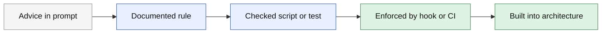
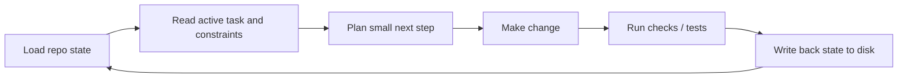
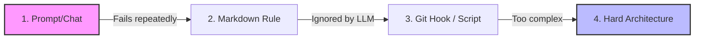

# buildos-readme-restructure-challenge-v2 — Challenger Reviews

## Challenger A — Challenges
Below is a concrete evaluation and a complete proposed restructure.

---

# Verdict

No — the current README format is not the right default for a GitHub landing page.

A GitHub README should answer, in roughly this order:

1. **What is this?**
2. **Who is it for?**
3. **Why should I care?**
4. **How do I start in 5 minutes?**
5. **Where do I go next?**

Right now the README behaves like a mini-essay version of the full framework. That makes it good for committed readers, but weak as a landing page for new visitors scanning in under 60 seconds.

The README should become a **gateway document**:
- short
- highly skimmable
- structured around decisions and actions
- linking into the full framework for detail

The full `docs/the-build-os.md` should remain the canonical deep explanation.

---

# 1. Structure: What format works better?

## Current problem
Your current README has:
- too much prose before orientation
- too few visual anchors
- too many concept-heavy section titles
- duplication of ideas already covered in the full doc
- weak “entry paths” for different reader types

A newcomer opening the repo likely wants one of three things:
- “What is Build OS?”
- “How do I adopt this?”
- “Do I need this now, or later?”

The current essay structure makes all three harder.

## Better README format
Use a **layered README**:

### Layer 1: 15-second orientation
A short value proposition plus 3 bullets:
- what it is
- what problem it solves
- who it’s for

### Layer 2: 30-second scan
A compact “How it works” section with a diagram and 4–6 bullets.

### Layer 3: 60-second action
A starter checklist and links:
- read this
- copy these files
- start at this tier
- add these controls later

### Layer 4: navigation
A clean map to the full docs by topic.

That means:
- less philosophy in README
- more framing + practical routing
- only the 2–3 most important concepts explained inline
- everything else linked out

---

# 2. Grouping: Natural conceptual clusters from the 10-part full doc

Yes, the 10 parts can be grouped into fewer conceptual clusters very naturally.

## Recommended grouping model: 4 clusters

### Cluster A — Foundations
**Why this exists, what Build OS is, and when to use it**
Includes:
- Part I: Philosophy
- Part II: Governance Tiers

Suggested label:
- **Foundations**
or
- **Why Build OS exists**

Why this grouping works:
- Philosophy explains the reasoning
- Tiers explain applicability and maturity
- Together they answer: “Should I care, and how much structure do I need?”

---

### Cluster B — Operating Model
**How work flows through the system**
Includes:
- Part IV: Operations
- Part V: Enforcement Ladder
- Part VI: Memory Model

Suggested label:
- **How it works**
or
- **Operational model**

Why this grouping works:
These parts define the day-to-day mechanics:
- how a session runs
- how rules are enforced
- how state persists across sessions

This is the core “engine” of Build OS.

---

### Cluster C — Repository System
**Where the system lives in the repo**
Includes:
- Part III: File System
- Part VIII: Bootstrap

Suggested label:
- **Repo layout and setup**
or
- **Filesystem and bootstrap**

Why this grouping works:
These are implementation-facing:
- where files go
- how to initialize the system
- what to create first

This cluster is ideal for hands-on adopters.

---

### Cluster D — Reliability and Scale
**How the system stays trustworthy over time**
Includes:
- Part VII: Review and Testing
- Part IX: Patterns Worth Knowing
- Part X: Survival Basics

Suggested label:
- **Reliability and scale**
or
- **Operating safely at scale**

Why this grouping works:
These parts all deal with failure prevention and durability:
- testing and release controls
- common patterns and failure stories
- surviving long sessions, drift, compaction, destructive actions

This cluster answers: “How does this not degrade over time?”

---

## Alternative grouping model: 3 clusters
If you want even fewer top-level buckets:

### 1. Why & When
- Philosophy
- Governance Tiers

### 2. How
- Operations
- Enforcement Ladder
- Memory Model
- File System
- Bootstrap

### 3. Safety & Scale
- Review and Testing
- Patterns Worth Knowing
- Survival Basics

This is simpler and likely better for README navigation.

My recommendation:
- Use **3 clusters in README**
- Keep **4 clusters in docs index** if you want more precision

---

# 3. Diagrams: Which ones are worth it?

Not every concept needs a diagram. For a README, you want diagrams that:
- reduce explanation load
- compress a core concept
- are readable on GitHub mobile/desktop
- don’t create visual clutter

## Highest-value diagrams for README

### 1. Enforcement ladder
**Best README diagram**
Why:
- it’s a central Build OS idea
- it explains the move from advice to governance
- it’s easy to visualize in one compact stack
- it differentiates the project from generic prompting guides

Use this in README? **Yes**

---

### 2. Session loop
**Second-best README diagram**
Why:
- shows that Build OS is operational, not philosophical
- gives newcomers a mental model of daily use
- complements the enforcement ladder well

Use this in README? **Yes**

---

### 3. Governance tiers
**Good if compact**
Why:
- helps readers self-identify where they are
- prevents over-adoption by beginners
- frames progression cleanly

Use this in README? **Maybe**
Best if rendered as a compact table rather than a full diagram.

---

## Better left for docs, not README

### File system layout
Useful, but more implementation detail than landing-page orientation.
Put in docs, maybe with a small snippet in README.

### LLM boundary pattern
Important, but too abstract for a README unless Build OS is explicitly centered on this as the core thesis.

### Promotion lifecycle
Good diagram, but too secondary for the front page unless you replace the enforcement ladder with it.

---

## My recommendation: use exactly 2 diagrams in README
1. **Enforcement ladder**
2. **Session loop**

And use **one compact table** for governance tiers.

That gives:
- one “policy” visual
- one “workflow” visual
- one “where do I fit?” visual anchor

That is the best clarity-to-noise ratio.

---

# Actual diagram specs

## Diagram 1: Enforcement ladder
Use Mermaid flowchart or plain ASCII.

### Mermaid version


### Caption
**Move important rules up the ladder:** from suggestions to enforcement to system design.

### README placement
Immediately after “How Build OS works” or inside “Core ideas”.

---

## Diagram 2: Session loop
### Mermaid version


### Caption
**A Build OS session is a loop:** load context, make a bounded change, verify it, persist state.

### README placement
Near “How to use it” or “What changes in practice”.

---

## Compact governance tiers table
Use table, not diagram.

| Tier | Team / Use Case | Controls |
|---|---|---|
| 0 | Solo experimentation | Prompts, conventions |
| 1 | Repeated project work | Repo memory, task/state files |
| 2 | Shared or production work | Tests, review gates, scripts |
| 3 | High-risk / scaled workflows | Hooks, CI enforcement, stronger architecture |

### Caption
Start at the lowest tier that matches your risk.

---

# 4. Scannability: Concrete changes for 30-second readability

Here are specific changes, not generic advice.

## A. Add a 3-line hero section at the top
Example:

**The Build OS** is a governance framework for building with Claude Code.  
It helps you move from “prompting a model” to “running a repeatable engineering system.”  
Use it when AI work needs memory, boundaries, enforcement, and reliable change control.

This should be 3 lines max.

---

## B. Add a “Who this is for / not for” box
Example:

> **Use Build OS if:** you’re doing repeated AI-assisted development, want persistent project memory, or need guardrails beyond prompts.  
> **Don’t start here if:** you only want a few ad hoc Claude Code commands.

This instantly reduces reader uncertainty.

---

## C. Add a “In 30 seconds” bullet block
Example:
- **Core idea:** move important state from chat into files
- **Core boundary:** let the model propose, but make the repo enforce
- **Core progression:** guidance → rules → checks → architecture
- **Core workflow:** load state, make small changes, verify, persist

This is one of the highest-value changes.

---

## D. Replace essay headers with decision-oriented headers
Current headers are literary and interesting, but weak for scanning.

Instead of:
- “The first mistake: treating Claude like a chatbot”

Use:
- **What Build OS changes**
or
- **From chatbot usage to governed workflow**

Instead of:
- “The hidden lever: move state to disk”

Use:
- **Persist state in the repo, not the chat**

Instead of:
- “The missing discipline: testing, rollback, and release control”

Use:
- **Add verification before trust**

The README should optimize for navigation, not rhetoric.

---

## E. Use one “starter path” with numbered steps
Not just bullets. Use:
1. Read the overview
2. Pick your governance tier
3. Create the core files
4. Start with one active task
5. Add tests/hooks only when failure becomes costly

This creates momentum.

---

## F. Add a “Docs map”
Example:

- **New here?** Read `docs/the-build-os.md#part-i-philosophy`
- **Need setup?** Go to Bootstrap
- **Need repo structure?** Go to File System
- **Need controls?** Go to Enforcement Ladder + Review and Testing
- **Hitting long-session issues?** Go to Survival Basics

This turns README into an actual router.

---

## G. Use bold labels inside bullets
Example:
- **State:** store goals, decisions, and active work in files
- **Boundary:** don’t let the model silently own policy
- **Enforcement:** promote repeated lessons into checks
- **Reliability:** use tests, rollback, and release controls

This makes scan-reading much easier.

---

## H. Keep README under ~110 lines
Current is 155 lines. A landing README this conceptual should probably be:
- **90–120 lines** if diagram-heavy
- **70–95 lines** if text-only

---

# 5. Information architecture: should the README duplicate philosophy?

Mostly no.

## Current duplication problem
The README essay sections are expanded versions of the Philosophy section in the full doc. That creates a bad middle ground:
- too long for a landing page
- too shallow for a full treatment
- repetitive once the reader enters the docs

## Better division of labor

### README should be:
- gateway
- orientation
- practical entrypoint
- concise statement of the model
- links to full detail

### Full doc should be:
- canonical explanation
- edge cases
- rationale
- examples
- implementation details
- progression paths

## Rule of thumb
If a section needs more than ~8–12 lines in README, it probably belongs in docs unless it is:
- Quick Start
- Who this is for
- Core concept summary

The philosophy material should be compressed into:
- one short “Why it exists” section
- one 4-bullet “Core ideas” section

Then link to Part I for full detail.

---

# 6. Concrete README outline

Below are two complete options. I recommend Option A.

---

# Option A — Best overall: Gateway README
Target length: **95–115 lines**

## 1. Title + one-sentence value proposition — 3 lines
- Project name
- One-sentence definition
- One-sentence problem statement

**Example section name:**  
`# The Build OS`

---

## 2. What this is / Who it’s for — 6 lines
- 2 bullets: what it is
- 2 bullets: use it if
- 1 bullet: not for casual one-off use

**Section name:**  
`## What it is`

---

## 3. In 30 seconds — 6–8 lines
A compact bullet summary:
- move state to disk
- define the model boundary
- promote repeated lessons into enforcement
- start with the lightest governance tier
- verify before trust

**Section name:**  
`## In 30 seconds`

---

## 4. How Build OS works — 10–12 lines
Short explanation plus session loop diagram.

**Section name:**  
`## How it works`

Contents:
- 4–5 lines of intro
- session loop diagram
- 2 lines of interpretation

---

## 5. From guidance to governance — 10–12 lines
Short explanation plus enforcement ladder diagram.

**Section name:**  
`## Guidance is not governance`

Contents:
- 4 lines of explanation
- enforcement ladder diagram
- 2–3 bullet implications

---

## 6. Choose your governance tier — 10–12 lines
Compact intro plus table.

**Section name:**  
`## Start at the right tier`

Contents:
- 2 lines of framing
- 4-row tier table
- 2 lines telling readers not to overbuild

---

## 7. Quick start — 12–15 lines
Numbered list.

**Section name:**  
`## Quick start`

Suggested steps:
1. Read the full overview doc
2. Choose Tier 0–3
3. Create the minimal repo memory files
4. Define active task + constraints
5. Run changes in small loops
6. Add tests/checks for repeated failures
7. Promote critical rules into hooks/CI later

---

## 8. Core concepts — 12–15 lines
Very short bullets, not essays.

**Section name:**  
`## Core concepts`

Sub-bullets:
- **State lives in files**
- **The model proposes; the repo decides**
- **Context must be recoverable**
- **Rules should become checks**
- **Reliability needs testing and rollback**

Each item gets 1–2 lines max.

---

## 9. Docs map — 12–14 lines
Group the 10 full-doc parts into 3 clusters.

**Section name:**  
`## Docs map`

Suggested structure:
- **Why & when** → Philosophy, Governance Tiers
- **How it works** → Operations, Enforcement Ladder, Memory Model
- **Setup** → File System, Bootstrap
- **Safety & scale** → Review and Testing, Patterns Worth Knowing, Survival Basics

Could be bullets with links.

---

## 10. Practical starter kit — 8–10 lines
Keep the checklist, but shorten and tighten.

**Section name:**  
`## Practical starter kit`

Use checkboxes:
- [ ] active task file
- [ ] repo memory
- [ ] decision log
- [ ] test/verification step
- [ ] rollback plan
- [ ] hooks for repeated failures
- [ ] fresh-session recovery path

---

## 11. Further reading / related docs — 5–6 lines
Short list only.

**Section name:**  
`## Further reading`

---

## 12. Contribution / status — 3–4 lines
Optional but useful for OSS context.

**Section name:**  
`## Status`

---

# Approximate total line count for Option A
- Title/hero: 3
- What it is: 6
- In 30 seconds: 7
- How it works: 11
- Guidance vs governance: 11
- Tiers: 11
- Quick start: 14
- Core concepts: 13
- Docs map: 13
- Starter kit: 9
- Further reading: 5
- Status: 4

**Total: ~107 lines**

This is the best target.

---

# Option B — Slightly more self-contained README
Target length: **125–145 lines**

Use this only if you want the README to teach more before routing out.

## Outline
1. Title + value prop — 3
2. What problem this solves — 8
3. What Build OS changes — 10
4. Core ideas — 15
5. Session loop diagram — 10
6. Enforcement ladder diagram — 12
7. Governance tiers table — 12
8. Quick start — 15
9. Files you’ll likely create — 10
10. Docs map — 14
11. Starter kit — 10
12. Further reading — 5
13. Status/contributing — 4

**Total: ~128 lines**

This works, but I think it risks drifting back toward “essay README.”

---

# Recommended section name replacements

Here are concrete replacements for the current essay-style headings.

| Current | Replace with |
|---|---|
| Why This Exists | **Why Build OS exists** |
| The first mistake: treating Claude like a chatbot | **From chatbot use to governed workflows** |
| The most important decision: where the model stops | **Set the model boundary early** |
| The hidden lever: move state to disk | **Persist state in the repo** |
| The difference between guidance and governance | **Guidance is not governance** |
| The default failure mode: complexity drift | **Prevent drift as complexity grows** |
| The missing discipline: testing, rollback, and release control | **Add verification, rollback, and release control** |
| The practical starter kit | **Practical starter kit** |

These are more scannable and easier to index mentally.

---

# My strongest recommendation

## Make the README a gateway, not a duplicate essay.
Specifically:

### Keep in README
- what Build OS is
- why it matters
- session loop
- enforcement ladder
- governance tiers
- quick start
- docs map

### Move detail to docs
- full philosophical argument
- extended rationale sections
- deep examples
- edge cases
- failure stories
- implementation nuance

That gives you:
- a README that works for first contact
- docs that work for serious adoption
- less duplication
- clearer progression from repo landing page to framework manual

---

# Final recommendation in one sentence

Restructure the README into a **100-line gateway document** organized around **What it is → How it works → What tier you need → How to start → Where to go next**, with exactly **two diagrams**: the **session loop** and the **enforcement ladder**.

If you want, I can next draft the README itself in full Markdown using this structure.

---

## Challenger B — Challenges
Here is a concrete, actionable restructuring proposal for The Build OS README.

### 1. Structure & Information Architecture
A GitHub README should not be a philosophical essay; it should be a **Gateway**. Developers decide whether to use a tool in the first 30 seconds. 
*   **The Fix:** Move the current essay sections ("The first mistake...", "The hidden lever...") into a separate `docs/philosophy.md` or keep them in Part I of the main doc. 
*   **The New README Format:** Hook → TL;DR → Quick Start → Core Concepts (with diagrams) → Routing Table (Where to go next).

### 2. Grouping the 10 Parts
The 10 parts in `docs/the-build-os.md` are overwhelming. Group them in the README routing table into **Three Core Pillars**:
1.  **Foundations (The "Why" & "What"):** Philosophy (I), Governance Tiers (II), Memory Model (VI).
2.  **Architecture (The "Where"):** File System (III), Enforcement Ladder (V).
3.  **Operations (The "How"):** Operations & Session Loop (IV), Review & Testing (VII), Bootstrap (VIII), Survival/Patterns (IX, X).

### 3. High-Value Diagrams (Specs included)
To avoid visual noise, limit the README to **two** diagrams. 

**Diagram 1: The Promotion Lifecycle (Enforcement Ladder)**
*Why:* It perfectly illustrates the core value proposition (how ad-hoc lessons become permanent rules).
*Type:* Mermaid Flowchart (Left to Right)


**Diagram 2: Governance Tiers**
*Why:* Shows developers exactly *when* to apply the framework based on project size.
*Type:* ASCII Table (faster to scan than a Mermaid diagram for this specific data).
```text
Tier 0: Scripts      ➔ No governance needed.
Tier 1: Single App   ➔ Basic Markdown rules + System prompts.
Tier 2: Multi-Agent  ➔ Git hooks + Contract testing.
Tier 3: Enterprise   ➔ Hard architecture + CI/CD enforcement.
```

### 4. Scannability Improvements
*   **TL;DR Blockquote:** Place a 2-sentence summary at the very top.
*   **Callout Boxes:** Use GitHub markdown alerts (e.g., `> [!IMPORTANT]`) for the "Default Failure Mode" warning.
*   **Icons:** Use emojis strictly for section headers to serve as visual anchors (e.g., 🚀 Quick Start, 🧠 Core Concepts).

---

### 5. Concrete README Outline (Target: ~85 lines)

Here is the exact structure to implement, cutting the length by nearly 50% while vastly improving usability.

**Title: The Build OS** (Line 1)
**Badges:** License, Version, Build passing (Lines 2-3)

**Section 1: TL;DR** (~5 lines)
*   Blockquote defining the project: *"A governance framework for building software with Claude Code. It stops AI complexity drift by moving context from chat windows to disk-based enforcement."*

**Section 2: 🚀 Quick Start** (~10 lines)
*   3-step copy-paste code block to clone the starter kit and initialize the file structure.

**Section 3: 🧠 Core Concepts** (~25 lines)
*   **The Enforcement Ladder:** (Insert Mermaid Diagram 1 here). Brief explanation of moving from Chat -> Markdown -> Hooks -> Architecture.
*   **State on Disk:** 3 bullet points explaining why context must live in the repo, not the LLM's memory.

**Section 4: ⚖️ Governance Tiers** (~10 lines)
*   (Insert ASCII Diagram 2 here). Helps users identify where their project currently sits.

**Section 5: 🗺️ Documentation Directory (The Routing Table)** (~20 lines)
*   Grouped links to `docs/the-build-os.md` using the Three Pillars (Foundations, Architecture, Operations).
*   *Example:* 
    *   **Architecture:** 
        *   [File System Layout](link) (Where to put your rules)
        *   [Enforcement Ladder](link) (How to escalate constraints)

**Section 6: 📖 Philosophy (For the Curious)** (~10 lines)
*   A brief hook: *"Why did we build this? Because treating Claude like a chatbot is the first mistake..."*
*   Link to the extracted essay/philosophy document. 

**Section 7: Contributing & License** (~5 lines)
*   Standard boilerplate.

---
