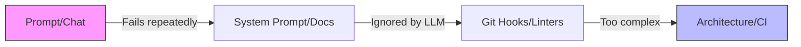
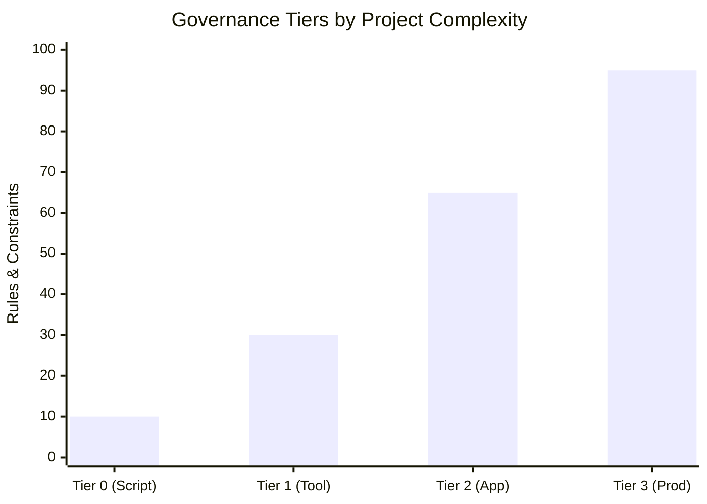

# buildos-readme-restructure — Challenger Reviews

## Challenger A — Challenges
Here is a concrete, actionable restructuring plan for **The Build OS** README and documentation architecture.

### 1. Structure & Information Architecture
A GitHub README should not be a philosophical essay. It must be a **gateway**. Developers landing on the repo need to know three things in 60 seconds: *What is this? Do I need it? How do I start?* 

The current essay sections ("The first mistake...", "The hidden lever...") should be moved to `docs/philosophy.md`. The README must be stripped down to a high-density, highly scannable entry point that routes users to the 10-part framework.

### 2. Grouping the 10 Parts
The 10 parts in `docs/the-build-os.md` are overwhelming. Group them into **Three Core Pillars** in the README routing table:

*   **Pillar 1: Theory & Governance (The "Why" & "When")**
    *   Part I: Philosophy
    *   Part II: Governance Tiers
    *   Part V: Enforcement Ladder
*   **Pillar 2: Architecture & State (The "Where")**
    *   Part III: File System
    *   Part VI: Memory Model
*   **Pillar 3: Operations & Execution (The "How")**
    *   Part IV: Operations (Session Loop)
    *   Part VII: Review and Testing
    *   Part VIII: Bootstrap
    *   Part IX: Patterns Worth Knowing
    *   Part X: Survival Basics

### 3. High-Impact Diagrams (Mermaid Specs)
To break up text, use **two** Mermaid diagrams. 

**Diagram 1: The Promotion Lifecycle (Enforcement Ladder)**
*Why:* Shows how a lesson becomes a hardcoded rule.

**Diagram 2: Governance Tiers**
*Why:* Helps users immediately identify where their project sits.

### 4. Scannability Improvements
*   **TL;DR Block:** A blockquote at the very top summarizing the framework in 2 sentences.
*   **Icons:** Use emojis (🏗️, 🧠, 🛡️) for the pillar groupings.
*   **Tables:** Convert the "Practical starter kit" into a markdown checklist (`- [ ]`).
*   **Collapsible Sections:** Hide the "Why this exists" philosophical motivation behind a `

Read the Philosophy
` tag.

---

### 5. Concrete Output: Restructured README Outline

Here is the exact structure, section names, and approximate line counts for the new README (targeting ~100 lines total).

**`README.md`**

*   **Title & Badges** (5 lines)
    *   `# 🏗️ The Build OS`
    *   Badges for License, Version, Claude Code compatibility.
*   **TL;DR / What is This?** (8 lines)
    *   A bolded blockquote: *"The Build OS is a governance framework for building software with Claude Code. It stops complexity drift by moving state to disk and enforcing strict operational boundaries."*
*   **Quick Start** (15 lines)
    *   Copy-pasteable bash commands to clone the starter kit or initialize the file structure.
    *   A 5-item `[ ]` markdown checklist for day-one setup.
*   **The Core Concepts (Visualized)** (25 lines)
    *   Insert **Diagram 1: The Promotion Lifecycle** (Mermaid).
    *   Briefly explain the core thesis: *Don't treat Claude like a chatbot. Treat it like a junior dev that needs guardrails.*
*   **Documentation Directory (The Routing Table)** (20 lines)
    *   A 3-column markdown table or structured list mapping to the Three Pillars (Theory, Architecture, Operations). Links directly to anchor tags in `docs/the-build-os.md`.
*   **Governance Tiers Explained** (15 lines)
    *   Insert **Diagram 2: Governance Tiers** (Mermaid).
    *   Bullet points explaining when to upgrade from Tier 0 -> Tier 1 -> Tier 2.
*   **Philosophy & Deep Dives** (10 lines)
    *   `
` block containing a condensed version of "Why This Exists".
    *   Link to `docs/philosophy.md` for the full essays.
*   **Contributing & License** (5 lines)
    *   Standard open-source boilerplate.

*(Total estimated length: ~103 lines. Highly scannable, visual, and acts as a pure routing gateway).*

---

## Challenger B — Challenges
Here is a concrete, actionable evaluation and restructuring plan for The Build OS README.

### 1. Structure & Information Architecture
A longform essay is the **wrong format** for a GitHub README. A README is a landing page, not a manifesto. Developers visiting a repo want to know three things immediately: *What is this? Will it solve my problem? How do I try it?* 

**Recommendation:** Move the essay sections ("The first mistake...", "The hidden lever...", etc.) into a new file: `docs/philosophy.md` or a blog post. Transform the README into a strict **gateway document** that focuses on routing, quick starts, and high-level mental models.

### 2. Grouping the 10 Parts
The 10 parts in `docs/the-build-os.md` are overwhelming. Group them into three conceptual clusters in the README's "Documentation Directory" section:

*   **1. The Framework (Why & What):** Philosophy (I), Governance Tiers (II), Memory Model (VI).
*   **2. Implementation (Where & When):** File System (III), Enforcement Ladder (V), Bootstrap (VIII).
*   **3. Operations (How):** Operations & Session Loop (IV), Review & Testing (VII), Patterns (IX), Survival Basics (X).

### 3. High-Impact Diagrams
Visuals should replace text, not duplicate it. Use **Mermaid.js** diagrams natively supported by GitHub. The two most critical diagrams to include in the README are:

**Diagram 1: The Promotion Lifecycle (Enforcement Ladder)**
*Why:* It perfectly captures the core value prop of the OS (moving from vibes to code).
*Spec:* A Mermaid `flowchart LR` showing the progression:
`[Prompt/Lesson] --> [Markdown Rule] --> [Git Hook/Linter] --> [Architecture/Code]`

**Diagram 2: The Session Loop**
*Why:* Shows developers exactly how to work with Claude Code day-to-day.
*Spec:* A Mermaid `stateDiagram-v2` showing the circular flow:
`Plan --> Execute --> Verify --> Commit/Compact --> Fresh Session`

### 4. Scannability Improvements
*   **TL;DR Block:** Add a blockquote right under the title summarizing the project in exactly two sentences.
*   **Callout Boxes:** Use GitHub's native markdown alerts (`> [!NOTE]`, `> [!IMPORTANT]`, `> [!WARNING]`) for crucial rules (e.g., "Never treat Claude like a chatbot").
*   **Icons:** Use standard emojis for section headers (🚀 Quick Start, 📚 Documentation, 🧠 Core Concepts) to create visual anchors.
*   **Collapsible Sections:** If you must keep some essay content in the README, wrap it in `

Read the Philosophy
...
`.

---

### 5. Concrete Output: Restructured README Outline

Here is the exact proposed structure for the new README.md. 

**Total Estimated Length:** ~110 lines (down from 155, but with 3x the scannability).

**1. Header & TL;DR (approx. 15 lines)**
*   `# The Build OS`
*   Badges (License, Status, Version).
*   `> **TL;DR:** A governance framework and operational system for building software with Claude Code. It stops complexity drift by shifting LLM guidance from soft prompts to hard architectural constraints.`

**2. 🚀 Quick Start / Bootstrap (approx. 20 lines)**
*   3-step copy-paste terminal commands to clone the starter kit.
*   The "Practical Starter Kit" 7-item checklist (condensed into bullet points).

**3. 🧠 Core Concepts (approx. 35 lines)**
*   *Brief intro to the methodology.*
*   **Diagram 1:** Mermaid chart of the Enforcement Ladder (Guidance vs. Governance).
*   **Diagram 2:** Mermaid chart of the Daily Session Loop.

**4. 📚 Documentation Directory (approx. 25 lines)**
*   *Grouped links pointing to specific sections in `docs/the-build-os.md`.*
*   **The Framework:** Philosophy, Tiers, Memory Model.
*   **Implementation:** File System, Enforcement Ladder, Setup.
*   **Daily Operations:** Session Loop, Testing, Survival Basics.

**5. 📖 The Philosophy (approx. 10 lines)**
*   `

Why This Exists (Click to expand)
`
*   *Place a highly condensed, bulleted version of the current essay sections here, or link directly to `docs/philosophy.md`.*
*   `
`

**6. 🤝 Contributing & License (approx. 5 lines)**
*   Standard boilerplate.

---
